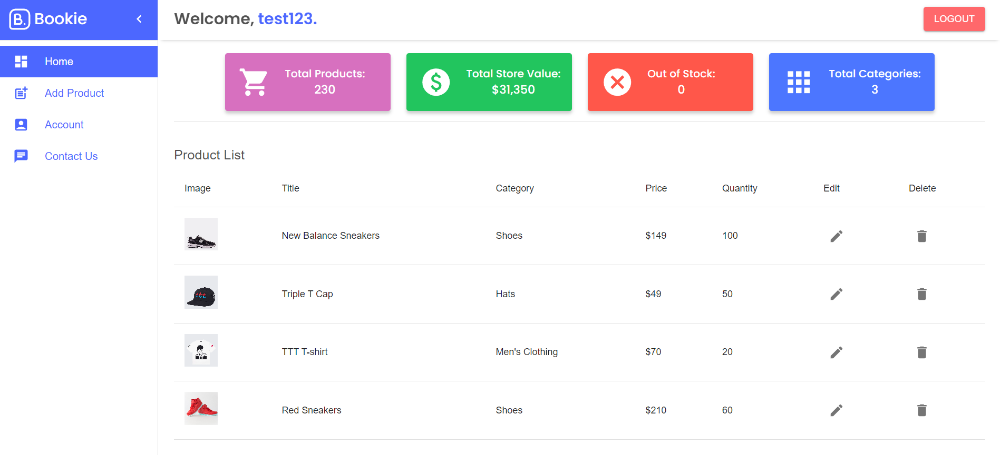

# Bookie.

An inventory manager create in React through Vite, with an intuitive UI where you manage your products, view your store value, and inventory. Created with a simulated login-page utilizing state management and contexts, and a backend server using Express.js.

Full responsiveness was considered out of scope as the project had a short turnaround, however, may be implemented in the future.

## Installation

Git clone https://github.com/jespertjarnfors/Bookie.git

Front end:
- 'cd client'
- 'npm install'
- 'npm run dev'

Back end:
- 'cd backend'
- 'npm install'
- 'node index.cjs'

### Contributing

Contributions are welcome! Please feel free to submit a pull request or open an issue.

### License

"This project is licensed under the MIT License."